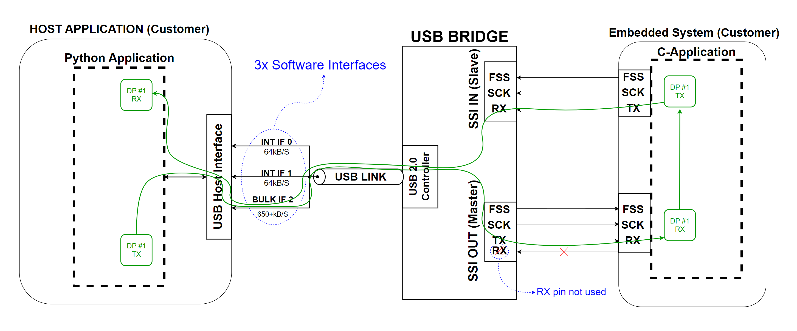
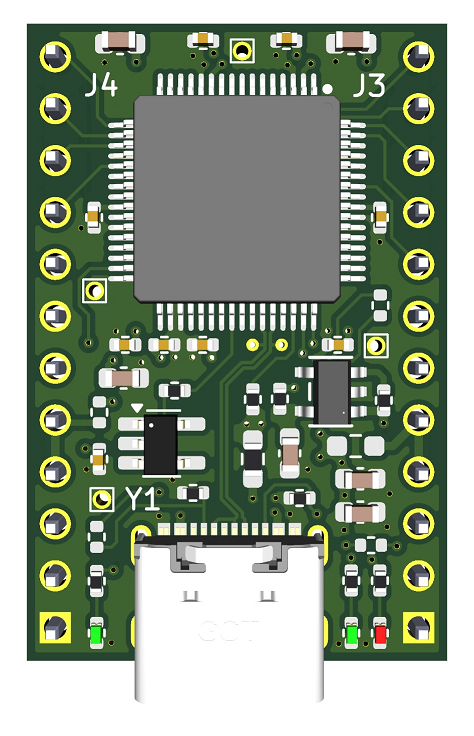
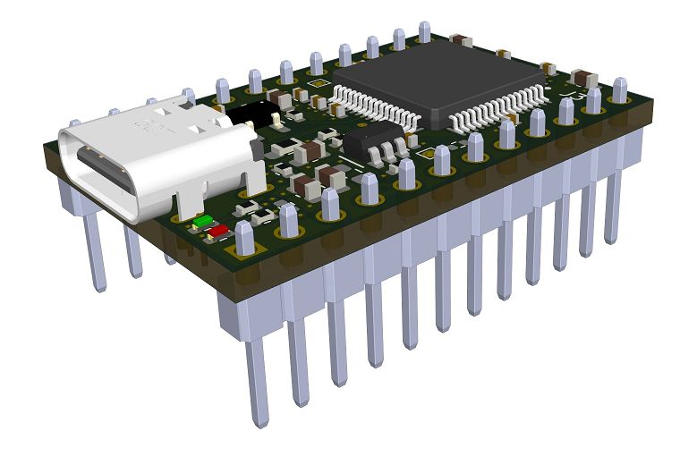
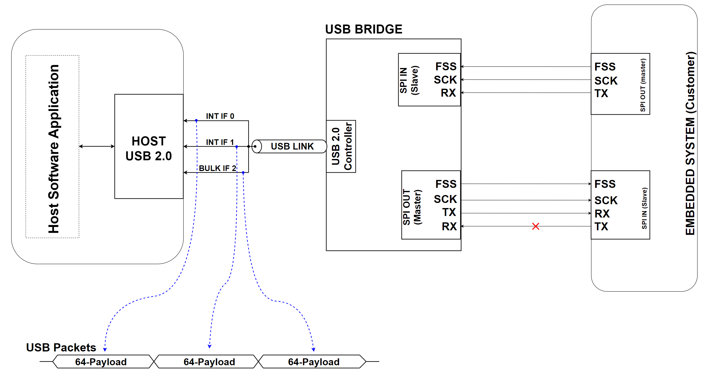
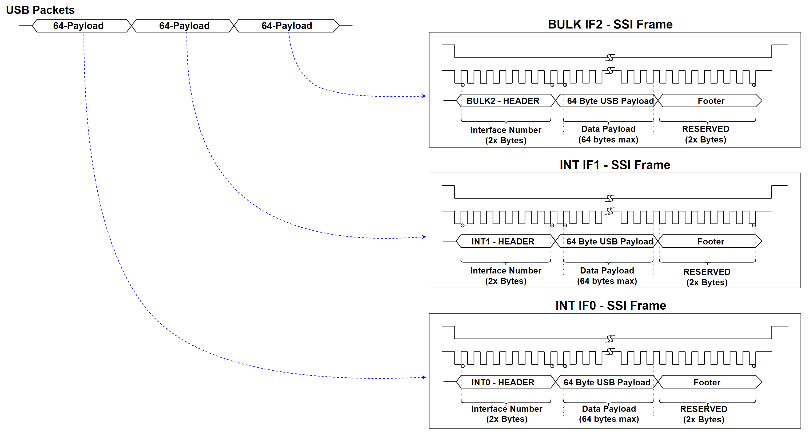
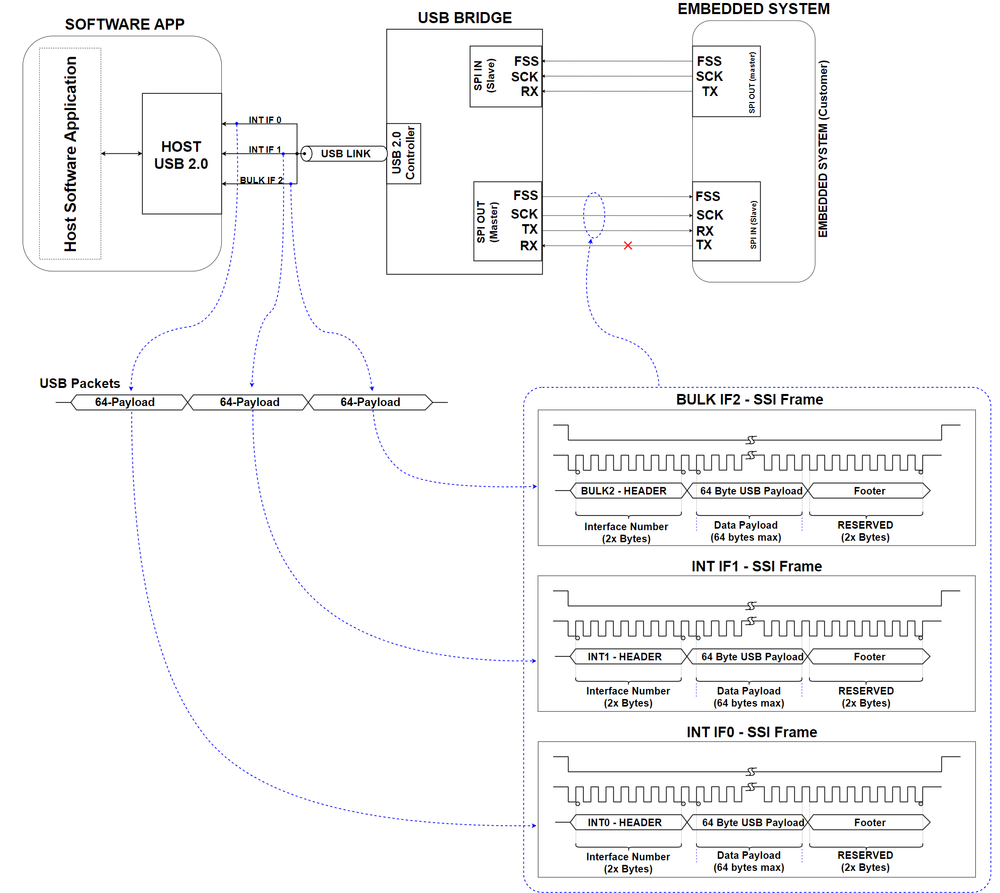
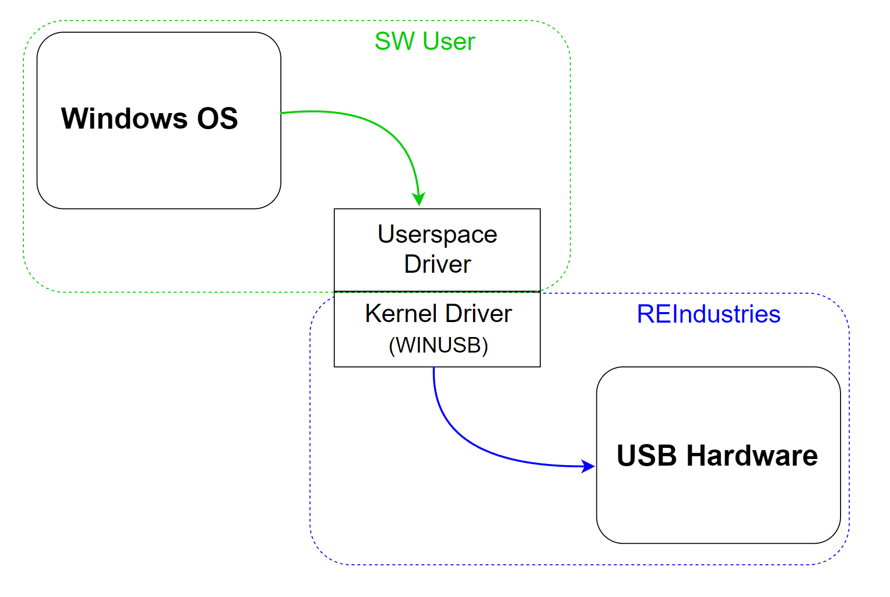
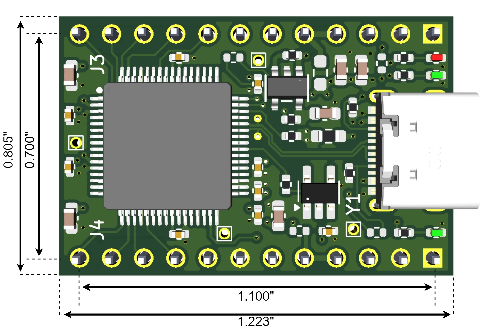
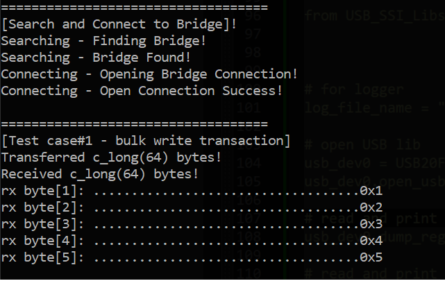
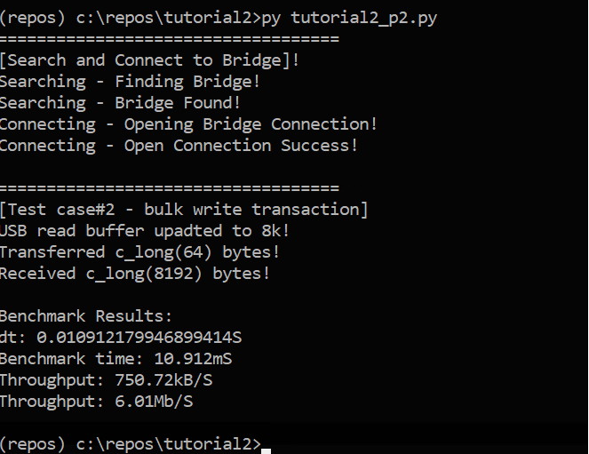

# 1. Overview
This tutorial introduces the BULK data path for the USB 2.0 bridge. This data path is interface 2 on the USB side of the bridge which interfaces to the host software application. In this tutorial we will find and connect to the USB bridge via VID/PID. Test case 1 will send a single BULK USB packet from software to the bridge which will be forwarded to an embedded emulator. The embedded emulator is a micro-controller which mimics a customer's embedded system. This single USB packet will contain a counter in the first few bytes along with a header value in the first byte position. The header value tells the embedded emulator to echo the packet back to the bridge and therefore back to software. The counter values will be verified upon reception, via software, of the echo'd packet. This is a simple 'hello world' type example.

Test case 2 is slightly more advanced where software will send a single USB packet to the bridge with a byte in position [0] denoting a specific operation requested of the embedded emulator on the other side. When the embedded emulator receives this packet it will respond with an 8k data block sent with no breaks or delays to the bridge. This data will flow through the bridge and will be received by the host software application. The intent of this test is to show a typical data burst over the high throughput data interface (BULK). The 8k read operation will be benchmarked in the host software application as well to capture what kind of performance we are getting from the brdige.

A block diagram of the data path from host application to the embedded emulator and back is shown below:


## 1.1 Bridge Overview
The USB bridge used in this tutorial is the USB2F-SSI-0-1A which, in general, is a small module that converts native USB traffic into SPI / synchronous serial traffic for an embedded system.  This part number supports 0.1" pitch through hole headers on both sides of the SOM and can fit in a standard prototyping breadboard. Many other configurations are available so visit [RisingEdgeIndustries](https://www.risingedgeindustries.com) online for more information or to ask about a custom solution. 

Bridge Top View             | Bridge Side View
:-------------------------:|:-------------------------:
 |  

The USB link is USB2.0 full speed composite device with 3x interfaces.  One interface is for internal bridge register access supporting operational and configuration changes. The other two interfaces are for high and low throughput data paths.  Each data path works with native USB 2.0 64 byte packets of data. The lower datarate interface is an interrupt interface capable of 64kB/s. This interface is polled by the USB host (workstation) every 1mS supporting deterministic latency. The second data interface is a BULK interface which can operate in excess of 650kB/s (5.2Mbit/s). This datarate is dependant on how much bandwidth is available on the USB bus per USB 2.0 BULK interface protocol. A BULK interface utilizes as much free bandwidth in each USB frame as possible to transfer data.

<u>Interface Summary</u>:
-	Interface 0: Bridge register access
-	Interface 1: INTERRUPT low throughput interface
-	Interface 2: BULK high throughput interface

The embedded systems side of this bridge consists of two unidirectional SSI/SPI ports. The TX and RX data is separate to allow the customer embedded system to operate based on data frame interrupts rather than polling the bridge checking for data constantly. The polling approach eats up valuable customer embedded system bandwidth / CPU cycles.

The master SSI/SPI port forwards all USB 64 byte packets out to the target embedded system as a 68 byte frame. The frame is larger than the USB packet because 4 additional bytes of meta data are added. The meta data allows target embedded systems to know which USB interface (INT1 or BULK2) the 64 byte packet came from. This allows the embedded systems engineer to be aware of which USB interface software sent the packet over. When the embedded system assembles a frame to transmist to the USB bridge RX interface, the firmware engineer must add this meta data to the frame so the bridge knows which USB interface to forward the 64 byte payload of the 68 byte frame to.

The meta data allows the software engineer and firmware engineer on either side of the bridge to stay in sync and know which interfaces data comes from and should be sent to. This can be very valuable when users need to logically separate different types of traffic. 

An example use case may be that an embedded system needs to send low data rate telemetry information back to software which can be done over INT1 (interrupt interface 1). The software engineer can launch a thread that constantly monitors for data on the USB interface and when available, reads the data and passes it to the main software application. The BULK2 (bulk 2) interface is used specifically for large data transfers to and from the target embedded system.

The bridge module is ideal for users that need a more intelligent solution than a virtual serial port for software application to embedded system communication but also need to retain the ease and siimplicity of a simple serial link.

Some of the key features/improvements are shown below:
-	3x different USB interfaces: Internal bridge register access, 64kB/s deterministic latency data interface, 650+kB/s high throughput interface.
-	Free to use any USB user space driver or develop a custom one
-	Auto enumerates with WINUSB Windows kernel driver
-	Separate TX and RX embedded synchronous serial data interfaces for interrupt driven firmware development
-	Plug and play solution utilizing REIndustries free Python library
-	Prototype friendly, footprint compatible with standard breadboards
-	Many functional configuration options via internal bridge register space

As mentioned above, 64 byte packets are transferred over each USB interface. A block diagram of this relationship is shown below:


This diagram shows all 3x USB interfaces including the internal bridge register access interface (INT0). The 64 byte data packets sent over INT0 are commands that support changing bridge register settings and this data is not forwarded out of the SSI serial ports to a target embedded system.

The INT1 and BULK2 interface packets are received by the bridge, meta data capturing which USB interface they were received on is wrapped around the 64 byte data packet yielding the 68 byte frame and that frame is sent out of the master SSI port to the target embedded system.

A diagram of the SSI frame side of the transfer is shown below:


The traffic flow through the bridge is shown below. This block diagram describes USB packets from software on the left flowing through the bridge to a target embedded system on the right.


When plugged in, the bridge tells Windows to load WINUSB.sys as the kernel space driver automatically and leaves the user space driver selection up to the user. A diagram of this is shown below:


This means the user must select a user space driver (there are multiple available 3d party drivers) to actually talk to the USB bridge. REIndustries has selected libusb1.0 (the Python implementation is just libusb) to use for these tutorials as it is cross platform and supported as a Python library. This design and architecture choice was made to provide more advanced control to software engineers that are looking for a more robust and advanced link compared to a virtual serial port, but still want to keep things reasonably simple. For users looking for a COTS solution, a Python user space drive can be used as in this example and easily wrapped as we have shown with the associated usb library example supporting this tutorial series.

For all tutorials, the Python libusb library can be installed using "pip install libusb". This must be performed as a first step in this tutorial series.


## 1.2 Mechanical
The bridge module consists of an 0.062" thick PCB with a USB-C connector for software application connectivity and unloaded headers (via holes) supporting the embedded sysnchronous serial interfaces. Customers can load either male or female headers depending on the required interface to their PCB hardware system.

The dimensions shown below are 1.223 inches long by 0.805 inches high. These are PCB edge to edge dimensions.


 

# 2. Details
This tutorial consists of two parts (test cases). Test case 1 acts as a hello world example and test case 2 shows the BULK interface moving 8k worth of data. This transaction is benchmarked as well showing typical performance of the bridge. 

## 2.1 Test Case 1
In test case 1, the host software application (in this case our Python example code) will find and connect to the USB bridge as well as create a packet and transmit it to the bridge. The embedded emulator will recieve and respond to the bridge by echo'ing the packet back. This example uses a Python wrapped libusb1.0 library for USB access. This is an open source user space driver.

The first step is to import libraries, define constants and data structures. It is important to remember that ctypes must be used and does slightly increase the complexity. REIndustries provides a simpler development library in Python that makes this easier. 

```python
import ctypes as ct
import libusb as usb
import time


#
# Definitions
#
DEF_VID = 0x1cbf
DEF_PID = 0x0007
ENDPOINT_BLK2_OUT = 0x03
ENDPOINT_BLK2_IN = 0x83 

EP2IN_SIZE = 64*1
EP2IN_TIMEOUT = 1000 	# mS

EP2OUT_SIZE = 64*1
EP2OUT_TIMEOUT = 250 	# mS


#
# Libusb variables/data structures
#
dev = None
dev_found = False

dev_handle = ct.POINTER(usb.device_handle)() 	# creates device handle (not device obj)
devs = ct.POINTER(ct.POINTER(usb.device))() 	# creates device structure
ep_data_out = (ct.c_ubyte*(EP2OUT_SIZE))()
ep_data_in = (ct.c_ubyte*(EP2IN_SIZE))()
bulk_transferred = ct.POINTER(ct.c_int)()	

#
# inits
#
bulk_transferred.contents = ct.c_int(0)
```

The next step is to find and connect to the USB bridge. This is done by the "find_bridge" function which utilizes the bridge VID and PID for identification.

```Python
def find_bridge(VID, PID):
	print('===================================')
	print('[Search and Connect to Bridge]!')
	print('Searching - Finding Bridge!')
	# open usb library
	r = usb.init(None)
	if r < 0:
		print(f'usb init failure: {r}')
		return (1, -1)

	# get list of USB devices
	cnt = usb.get_device_list(None, ct.byref(devs))
	# error check
	if cnt < 0:
		print(f'get device list failure: {cnt}')
		return (1, -1)

	# Check all USB devices for VID/PID match
	i = 0
	while devs[i]:
		dev = devs[i]

		# get device descriptor information
		desc = usb.device_descriptor()
		r = usb.get_device_descriptor(dev, ct.byref(desc))
		# error check
		if r < 0:
			print(f'failed to get device descriptor: {r}')
			return (1, -1)

		if(desc.idVendor == DEF_VID) and (desc.idProduct == DEF_PID):
			dev_found = True		
			break

		i += 1

	#
	# open device if matching vid/pid was found
	#
	if(dev_found == True):
		print('Searching - Bridge Found!')
		print('Connecting - Opening Bridge Connection!')
		r = usb.open(dev, dev_handle)
		# error check
		if r < 0:
			print(f"ret val: {r} - {usb.strerror(r)}")
			print("failed to open device!")
			return (1, -1)
		else:
			print('Connecting - Open Connection Success!')

		return (0, dev_handle)
```
If the device is found, the device handle is returned and used for USB access and communications. Assuming a success, the following code is executed.
```Python
# ------------------------------------------------------------
# Description: testcase1_exe
# ------------------------------------------------------------
# Test case 1 sends a single bulk packet from software
# to the embedded emulator. The emulator receives this 
# packet from the bridge and echo's it back as an SSI
# frame. A packet is created with a flag byte of 10d 
# indicating the embedded emulator should perform an echo
# operation and a counter with values 1-5 following. These
# values are verified in the packet received by software.
# ------------------------------------------------------------
def testcase1_exe(dev_handle):
	print('\n===================================')
	print('[Test case#1 - bulk write transaction]')

	# claim interface 2 - bulk interface
	r = usb.claim_interface(dev_handle, 2)
	# error check
	if(r != 0):
		print(f'ERROR: failed to claim interface, ret val = {r}')
		print(f"ERROR: code - {usb.strerror(r)}")

	# --------------------------------------
	# Handle Transmit Case
	# --------------------------------------
	ep_data_out[0] = 10	 	# indicates loopback operation to
							# embedded emulator

	ep_data_out[1] = 1		# dummy data to check to verify rx'd
	ep_data_out[2] = 2 		# looped back data
	ep_data_out[3] = 3
	ep_data_out[4] = 4
	ep_data_out[5] = 5

	# execute write transaction
	r = usb.bulk_transfer(dev_handle, ENDPOINT_BLK2_OUT, ep_data_out, 
							EP2OUT_SIZE, bulk_transferred, EP2OUT_TIMEOUT)	
	print(f'Transferred {bulk_transferred.contents} bytes!')


	# --------------------------------------
	# Handle Receive Case
	# --------------------------------------

	# execute write transaction	
	r = usb.bulk_transfer(dev_handle, ENDPOINT_BLK2_IN, ep_data_in, 
							EP2IN_SIZE, bulk_transferred, EP2IN_TIMEOUT)	
	# error check
	if (r < 0):
		print(f'ERROR: Total bytes transferred <{bulk_transferred.contents}> bytes!')
		print(f'ERROR: Expected to xfer <{EP2IN_SIZE}> bytes!')
		print(f'ERROR: bulk_transfer() ret code <{r}> bytes!')
		return (1, -1)
	else:	
		print(f'Received {bulk_transferred.contents} bytes!')

	# print read result
	print(f"{'rx byte[1]: ':.<30}{f'{ep_data_in[1]:#02x}':.>20}")
	print(f"{'rx byte[2]: ':.<30}{f'{ep_data_in[2]:#02x}':.>20}")
	print(f"{'rx byte[3]: ':.<30}{f'{ep_data_in[3]:#02x}':.>20}")
	print(f"{'rx byte[4]: ':.<30}{f'{ep_data_in[4]:#02x}':.>20}")
	print(f"{'rx byte[5]: ':.<30}{f'{ep_data_in[5]:#02x}':.>20}")
```

If the teset case executes successfully, the console should display the following information.

<div align='center'>
	
</div>

This completes tutorial 2 part 1 serving as a hello world example of the high throughput BULK interface.


## 2.2 Test Case 2
The intent of test case #2 is to show the BULK interface moving a larger block of data which would be more typically seen with customer implementations. The host software will send a BULK USB packet to the bridge with a byte indicating the embeded emulator should immediately respond with 8k worth of dummy data. The USB packet from host software will be sent to the brdige and the bridge will parse and repackage the 64 bytes of USB into a 68 byte SSI frame.

Once the host software sends the initial USB command packet (indicating the embedded emulator should respond with 8k of data) host software performs a blocking read with a timeout - waiting for the 8k data block response. If this does not happen fast enough the read operation times out with a read error.

Tutorial #2 part 2 starts off with the same library and data structure definitions.

```Python
import ctypes as ct
import libusb as usb
import time


#
# Definitions
#
DEF_VID = 0x1cbf
DEF_PID = 0x0007
ENDPOINT_BLK2_OUT = 0x03
ENDPOINT_BLK2_IN = 0x83 

EP2IN_SIZE = 64*1
EP2IN_TIMEOUT = 1000 	# mS

EP2OUT_SIZE = 64*1
EP2OUT_TIMEOUT = 250 	# mS


#
# Libusb variables/data structures
#
dev = None
dev_found = False

dev_handle = ct.POINTER(usb.device_handle)() 	# creates device handle (not device obj)
devs = ct.POINTER(ct.POINTER(usb.device))() 	# creates device structure
ep_data_out = (ct.c_ubyte*(EP2OUT_SIZE))()
ep_data_in = (ct.c_ubyte*(EP2IN_SIZE))()
bulk_transferred = ct.POINTER(ct.c_int)()	

#
# inits
#
bulk_transferred.contents = ct.c_int(0)
```

After this, the same find_bridge function is used to find the USB bridge via PID/VID.

```Python
def find_bridge(VID, PID):
	print('===================================')
	print('[Search and Connect to Bridge]!')
	print('Searching - Finding Bridge!')
	# open usb library
	r = usb.init(None)
	if r < 0:
		print(f'usb init failure: {r}')
		return (1, -1)

	# get list of USB devices
	cnt = usb.get_device_list(None, ct.byref(devs))
	# error check
	if cnt < 0:
		print(f'get device list failure: {cnt}')
		return (1, -1)

	# Check all USB devices for VID/PID match
	i = 0
	while devs[i]:
		dev = devs[i]

		# get device descriptor information
		desc = usb.device_descriptor()
		r = usb.get_device_descriptor(dev, ct.byref(desc))
		# error check
		if r < 0:
			print(f'failed to get device descriptor: {r}')
			return (1, -1)

		if(desc.idVendor == DEF_VID) and (desc.idProduct == DEF_PID):
			dev_found = True		
			break

		i += 1

	#
	# open device if matching vid/pid was found
	#
	if(dev_found == True):
		print('Searching - Bridge Found!')
		print('Connecting - Opening Bridge Connection!')
		r = usb.open(dev, dev_handle)
		# error check
		if r < 0:
			print(f"ret val: {r} - {usb.strerror(r)}")
			print("failed to open device!")
			return (1, -1)
		else:
			print('Connecting - Open Connection Success!')

		return (0, dev_handle)
```

If the brdige is found, a device handle is returned to the caller so we can connect and transfer data to the bridge.

Once we find the brdige, our host application can transfer data. The single packet transmit (from host software) and 8k byte read is shown below.

```Python
# ------------------------------------------------------------
# Description: testcase2_exe
# ------------------------------------------------------------
# Test case 2 sends a single BULK packet to the bridge which
# is forwaded on to the embedded emulator. The byte[0] value
# of the transmit operation tells the embedded emulator to
# respond with an 8k (SSI - serial) data burst. This 8k data
# transmission flows through the bridge and is received by
# host software during the 8k read (endpoint in) operation.
# ------------------------------------------------------------
def testcase2_exe(dev_handle):
	print('\n===================================')
	print('[Test case#2 - bulk write transaction]')

	# claim interface 2 - bulk interface
	r = usb.claim_interface(dev_handle, 2)
	# error check
	if(r != 0):
		print(f'ERROR: failed to claim interface, ret val = {r}')
		print(f"ERROR: code - {usb.strerror(r)}")

	
	# reconfigure endpoint buffers for 8k readback
	EP2IN_SIZE = 64*128
	ep_data_in = (ct.c_ubyte*(EP2IN_SIZE))()
	print("USB read buffer upadted to 8k!")


	# --------------------------------------
	# Handle Transmit Case
	# --------------------------------------
	ep_data_out[0] = 12	 	# indicates 8k readback operation
							# to embedded emulator


	# execute write transaction
	r = usb.bulk_transfer(dev_handle, ENDPOINT_BLK2_OUT, ep_data_out, 
							EP2OUT_SIZE, bulk_transferred, EP2OUT_TIMEOUT)	
	print(f'Transferred {bulk_transferred.contents} bytes!')


	# --------------------------------------
	# Handle Receive Case
	# --------------------------------------

	# execute write transaction
	start = time.time()
	r = usb.bulk_transfer(dev_handle, ENDPOINT_BLK2_IN, ep_data_in, 
							EP2IN_SIZE, bulk_transferred, EP2IN_TIMEOUT)
	stop = time.time()
	# error check
	if (r < 0):
		print(f'ERROR: Total bytes transferred <{bulk_transferred.contents}> bytes!')
		print(f'ERROR: Expected to xfer <{EP2IN_SIZE}> bytes!')
		print(f'ERROR: bulk_transfer() ret code <{r}> bytes!')
		return (1, -1)
	else:	
		print(f'Received {bulk_transferred.contents} bytes!')

	# print out time for 8k benchmark
	print("\nBenchmark Results:")
	dt = stop - start
	print(f"dt: {dt}S")
	print(f"Benchmark time: {round(dt*1000, 3)}mS")
	val = round((8192/dt)/1000, 2)
	#print(f"Throughput: {round((8192/dt)/1000, 2)}kB/S")
	print(f"Throughput: {val}kB/S")
	print(f"Throughput: {round(val*8/1000, 2)}Mb/S")


#
# Run module
#
r = find_bridge(DEF_VID, DEF_PID)

# check for errors
if(r[0] == 1):
	print(f"ERROR: ret val: {r}""}")
else:
	# on success - run test case #1
	testcase2_exe(r[1])
```


Below is an example benchmark for the 8k data block read transaction. This is timed from the host software perspective so it includes the latency through the USB bridge.

<div align='center'>
	
</div>


# 3. Conclusion
In conclusion, this tutorial shows a typical customer use case for a simple hello world data transaction over the BULK interface as well as an 8k command read from host software through the bridge to a target embedded system. A write case operates the same way as the read in this tutorial, but without the need for the initial command transaction.

With the INTERRUPT and BULK interface, customers can implement automatic periodic data transactions for low data rate needs and large throughput transactions, as shown here, for more demanding data applicaitons while still retaining the simple plug-and-play experience of a typical virtual serial port.

